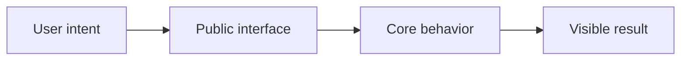

# {{FEATURE_TITLE}} technical specification

## Goals

- TODO(feature): State the user outcome this feature must produce.
- TODO(feature): State the observable behavior that counts as success.

### Non-goals

- TODO(feature): Name adjacent problems this feature deliberately does not solve.

## User journey

1. TODO(feature): Describe the user's first action.
2. TODO(feature): Describe the system response.
3. TODO(feature): Reach a visible, verifiable result by this step.

## Architecture

TODO(feature): Explain each boundary in plain language. Prefer real component,
command, table, and route names once they exist.

## Public interface

TODO(feature): Document commands, API routes, UI controls, configuration,
defaults, limits, and error behavior. Keep reference facts traceable to code.

## Data and lifecycle

TODO(feature): Describe durable records, ownership, state transitions, cleanup,
and backward compatibility.

## Security

TODO(feature): Describe trust boundaries, authorization, secret handling, input
limits, and what remains outside the security model.

## Failure modes

| Failure | User-visible behavior | Recovery |
|---|---|---|
| TODO(feature): dependency is unavailable | Describe the visible failure without partial state. | Describe a safe retry or reversal. |

## Rollout and reversal

TODO(feature): Describe compatibility, migration, feature gating if any, and
how to reverse the change without losing user data.
