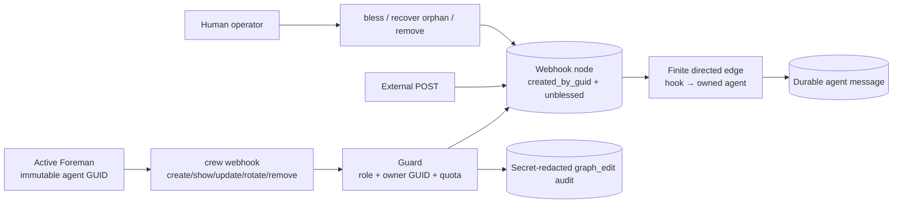

# Foreman-controlled webhook nodes technical specification

## Goals

- Let the active Foreman create, list, inspect, update, rotate, connect, and
  remove webhook nodes through the same CLI it uses to build the agent graph.
- Bind every hook-management decision to immutable creator GUID ownership,
  finite hook and edge quotas, human review state, and a secret-safe audit row.
- Preserve live hooks and their public delivery capability when a Foreman is
  revoked or deleted; control then falls back to the human operator.

### Non-goals

- Giving a plain agent hook-management authority.
- Letting a Foreman manage a human-created hook or another Foreman's hook.
- Letting a Foreman attach executable edge transforms, create inbound hook
  edges, or bypass the existing finite edge-cap policy.
- Creating an Internet tunnel; `public-webhook-ingress` owns that layer.
- Adding provider-specific authentication or signature validation.

## User journey

1. A human grants one agent the Foreman role.
2. The Foreman creates a hook with a description and deterministic message
   template. Crew returns its capability URL only after the guarded write.
3. The Foreman connects that hook to an agent it owns using finite positive
   edge limits.
4. An external POST becomes a normal durable Crew message on that route.
5. The human can review and bless both the hook and its route.
6. The Foreman can rotate or remove its hook. If the Foreman is revoked or
   deleted first, the hook remains live and becomes human-managed.

## Architecture



The CLI resolves the caller with Crew's existing anti-spoofing identity path.
Graphstore repeats the actor identity and ownership checks at the persistence
boundary. Hook admission and quota checks run under the same app-scoped lock as
creation so concurrent creates cannot exceed the configured limit.

## Public interface

```text
crew webhook create <name> [--description TEXT] [--template TEXT]
crew webhook list
crew webhook show <name>
crew webhook update <name> [--description TEXT] [--template TEXT]
crew webhook rotate <name>
crew webhook remove <name>
```

- `create` returns the new POST URL. Human-created hooks are blessed; hooks
  created by a Foreman record its name and immutable GUID and are unblessed.
- `list` omits capability URLs and raw token material. It resolves an active
  owner through the immutable GUID and shows that agent's current name. A
  revoked, deleted, or same-name replacement owner is reported as unavailable
  and human-managed.
- `show` is a guarded, audited secret read. A human or the exact current
  Foreman owner may see the URL and template.
- `update`, `rotate`, and `remove` use the same ownership boundary.
- `CREW_MAX_WEBHOOKS_PER_FOREMAN` sets the maximum number of live hooks owned
  by one Foreman. The default is 12 and invalid configuration falls back to
  that default.
- `crew bless <hook>`, `crew bless --edge <hook> <agent>`, and `crew bless
  --all` include webhook graph nodes.

Existing hook edge invariants remain in force. A Foreman-created hook can be
connected only as a directed source to an agent within that Foreman's immutable
ownership envelope. The edge must carry finite positive limits within the
configured ceilings.

## Data and lifecycle

Foreman-created hooks use the existing webhook row with:

```text
created_by       = <Foreman display name at creation>
created_by_guid  = <Foreman's immutable agent GUID>
blessed          = false
```

The GUID, not `created_by`, is the authority. A rename cannot redirect
ownership. Revocation immediately removes agent-side management authority but
does not disable the public hook. Deleting the owner also leaves the hook,
routes, receipts, and capability live. The human operator may inspect, rotate,
update, bless, or remove the orphan. Recreating an agent with the same name
creates a new GUID and grants no access to the old hook.

Removing an owned hook releases one quota slot. Historical messages and
delivery receipts keep their immutable provenance under the existing webhook
lifecycle rules.

## Security

- Plain agents are default-denied for hook secret reads and mutations.
- Every privileged agent action requires both a live Foreman flag and an exact
  `created_by_guid` match. Caller names and hook names are not authorities.
- Quota admission and persistence are serialized so concurrent creates cannot
  pass a stale count.
- Audit sanitization walks nested dictionaries and lists. Capability tokens,
  token hashes, public URLs, templates, credential headers, and recognizable
  secret aliases are redacted before persistence. Refusal reasons are generic
  and do not interpolate hook rows.
- Applied `webhook_read` decisions are audited without persisting the returned
  secret.
- `list` never emits a URL. `show` and `rotate` print the capability only after
  authorization.
- Foreman hook routes keep the existing source-only topology rule, finite
  edge-cap ceilings, and human-only transform boundary.

## Failure modes

| Failure | User-visible behavior | Recovery |
|---|---|---|
| Caller is not the active Foreman | Command fails without exposing a URL or changing the hook | Ask the human to grant Foreman authority |
| Hook belongs to the human or another GUID | Command fails as outside the ownership envelope | Ask the human owner to perform the action |
| Hook quota is full | Creation fails before a row or URL is created | Remove an owned hook or raise the configured limit |
| Two creates race for the last slot | Exactly one commits; the other reports the quota failure | List hooks and retry after freeing capacity |
| Foreman is revoked or deleted | Hook stays callable, but agent-side management fails | Human manages it or deliberately grants authority to the same surviving GUID |
| A same-name agent replaces the owner | Replacement is denied because its GUID differs | Human manages or removes the orphan |
| Template is invalid | Create/update fails without partially changing the hook | Correct the deterministic template |
| Storage is unavailable | Command fails; no success or secret is claimed | Restore MorphDB and retry |

## Rollout and reversal

This feature reuses the additive creator GUID and blessing fields already
present on graph nodes. Human-created hooks preserve their existing behavior.
Removing the new Foreman guard cases and CLI commands returns hook management to
human-only operation without deleting hooks, routes, receipts, or messages.
