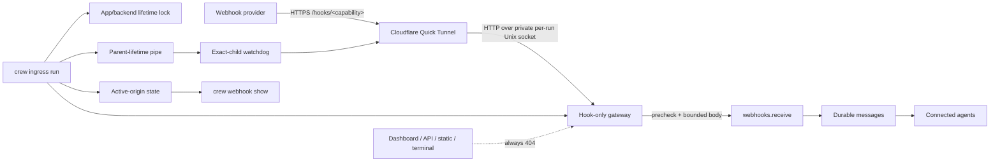

# Public webhook ingress technical specification

## Goals

- Turn each local Crew webhook capability into a temporary public HTTPS URL.
- Prove that real Internet traffic reaches the existing durable webhook
  delivery path while every dashboard/control-plane surface stays dark.
- Keep installation and lifecycle lean: one external binary, one foreground
  command, zero new Python or npm packages.

### Non-goals

- Stable production domains, an SLA, multiple tunnel providers, a daemon,
  automatic installation, Portless, Caddy, ngrok, or a provider abstraction.
- Publishing the dashboard, API, terminal, static assets, or arbitrary local
  ports.
- Hiding webhook payload plaintext from the chosen tunnel provider's TLS edge.

## User journey

1. The operator runs `crew ingress run` for one project.
2. Crew acquires that backend/project's lifetime lock, validates MorphDB,
   starts a hook-only gateway on a fresh private Unix socket, and launches a
   small watchdog that owns `cloudflared`.
3. Crew accepts a strict `*.trycloudflare.com` hostname only after a
   secret-gated public readiness probe reaches the gateway.
4. The active origin becomes visible to `crew webhook show`; external POSTs
   take the existing idempotent, durable fan-out path.
5. Control-C clears state, closes the parent-lifetime pipe, stops the retained
   child and gateway, and releases the lock. Hard parent death also closes the
   pipe, so the watchdog stops and reaps its exact child.

## Architecture



There is one tunnel per running Crew project, not one tunnel per webhook. The
existing random 256-bit URL capability remains the authorization boundary for
each hook.

## Public interface

```text
crew ingress run
crew ingress status
crew webhook show <name>
```

`run` is human-only and foreground. It refuses a second process for the same
canonical MorphDB origin and app. `status` is read-only. `webhook show` uses
the live tunnel origin when present, otherwise the existing configured base or
relative hook path.

If `cloudflared` is absent, Crew prints an explicit installation hint and
changes no project state. The application never downloads or updates it.

## Data and lifecycle

The only durable local metadata is a small owner-only JSON state file scoped by
the canonical MorphDB origin plus app. Its adjacent file lock is held for the
entire foreground lifetime. Readers trust state only while that lock is
contended; stale state after a crash is ignored. State contains only the public
base URL and lifecycle metadata, never a webhook token, full hook URL, or local
gateway endpoint. A new owner clears stale state while holding a shared lock
before upgrading to the exclusive lifetime lock, so predecessor state cannot
be attributed to a new process during takeover.

Each lease creates a unique owner-only `cloudflared` config that pins that
run's private `unix:/...` gateway service and disables chunked encoding for
the origin connection. The file is never rewritten or reused by a later lease,
is removed on orderly shutdown, and prevents the process from discovering or
mutating a user's Cloudflare configuration.

## Security

- The public tunnel origin is a fresh owner-only Unix socket in Crew's private
  runtime directory. Its path is never reused by a later run.
- Only raw `POST /hooks/<43 URL-safe characters>` is accepted.
- Query strings, percent escapes, trailing slashes, absolute request targets,
  transfer encoding, ambiguous lengths, oversized/slow bodies, and `Expect`
  are rejected before dispatch.
- Capability lookup happens before body allocation; `webhooks.receive`
  revalidates before durable delivery.
- Hop-by-hop and client/provider forwarding identity headers are stripped.
  Signature and idempotency headers remain available to templates/delivery.
- Admission is capped before thread creation; absolute header and body
  deadlines prevent slow peers from retaining those slots. Responses and
  parser failures are generic and never include request targets, headers,
  traces, or versions.
- The child receives a minimal allowlisted environment and no Crew, MorphDB,
  Cloudflare, agent, provider, or model credentials.
- Cloudflared runs with `--no-autoupdate`, info-level JSON logs, a private
  config ingress rule for the Unix origin, and `--hello-world`. Cloudflared
  requires either `--url` or `--hello-world` to enter Quick Tunnel mode even
  when config supplies ingress; config ingress takes precedence, so the
  built-in hello-world service is never the public origin.
- A separate standard-library watchdog owns the exact `cloudflared` process.
  It watches a non-inherited parent-lifetime pipe and terminates/reaps that
  child when the foreground CLI exits, including through `SIGKILL`.
- The dashboard server remains bound to loopback and is never the tunnel
  origin.

## Failure modes

| Failure | User-visible behavior | Recovery |
|---|---|---|
| `cloudflared` missing | `run` exits before gateway/state publication with an install hint. | Install the official binary and retry. |
| Backend/schema unavailable | `run` exits before public exposure. | Restore MorphDB and retry. |
| Tunnel never becomes ready | No state is published; child and gateway stop. | Check outbound connectivity and retry. |
| Child or gateway dies | Active state is removed and the surviving side is stopped. | Start `crew ingress run` again; update the provider with the new temporary URL. |
| Second run for same project | The second process refuses without touching the live process. | Use `crew ingress status` or stop the foreground owner. |
| Foreground process crashes | The OS releases the lock; readers ignore stale JSON; pipe EOF makes the watchdog stop its exact child. A leftover socket/config name is never reused. | Run ingress again; startup clears stale state and allocates a different socket and config path. |

## Rollout and reversal

No schema or webhook migration is required. Removing the command and ingress
components returns URL generation to its previous configured-base/relative
behavior; existing webhook nodes, edges, receipts, and messages are untouched.
