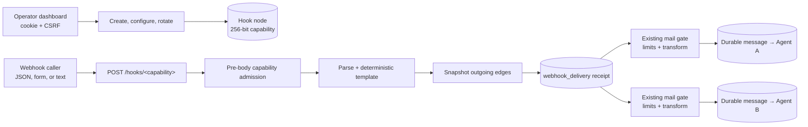

# Webhook graph nodes technical specification

## Goals

- Let an operator create, configure, rotate, connect, and delete a source-only
  webhook node.
- Turn one valid request into one durable message per snapshotted outgoing edge.
- Preserve existing edge authorization, limits, transforms, provenance,
  idempotency, queueing, and delivery semantics.
- Reject unsafe input before it creates a receipt or partial fan-out.

### Non-goals

- Managed public Internet tunneling; `public-webhook-ingress` owns that slice.
- Agent or Foreman hook management; `foreman-webhook-control` owns that slice.
- Executing stored Python or JavaScript from an unauthenticated request.
- Provider-specific signature or IP verification.
- Waiting synchronously for an agent runtime to consume the message.

## User journey

1. An authenticated operator creates a hook and optionally adds a template.
2. The operator connects the hook to one or more target agents.
3. A caller POSTs JSON, form data, or UTF-8 text to the capability URL.
4. Crew parses once, snapshots the outgoing edges, and durably accepts one
   message per eligible target.
5. The caller receives a bounded `202` result while agents consume the messages
   through Crew's existing background flusher.

## Architecture



The operator lane remains behind the dashboard cookie and CSRF boundary. The
capability route authorizes only fan-out for one hook. It checks the capability
before reading the body, then resolves it again before parsing and serialized
dispatch. Receipt creation shares an admission lock with configuration changes
and deletion: rotation cannot return while an old-token request is still
between its final capability check and durable receipt creation. Requests that
lose that race fail closed.

Parsing and templating finish before receipt creation. Each target then passes
through the existing mail acceptance transaction, retaining exact hook,
target, and edge GUID provenance. HTTP acceptance never waits for a runtime.

## Public interface

Authenticated controls:

```text
POST /api/webhook/create  {name, description, template}
POST /api/webhook/update  {guid, description, template}
POST /api/webhook/rotate  {guid}
POST /api/webhook/delete  {guid}
GET  /api/graph/snapshot  -> includes webhooks
```

Capability route:

```text
POST /hooks/<capability>
```

- Body limit: 1 MiB with one decimal `Content-Length`; transfer encoding is
  rejected.
- Payloads: JSON and `application/*+json`, form encoding, or UTF-8 text.
- Template roots: `payload`, `raw`, and lower-case non-credential `headers`.
  Authorization, cookie, proxy-credential, and `Set-Cookie` headers are absent.
- Blank-template fallback: `payload.message`, `payload.text`, then compact
  full-payload serialization.
- `202`: processing completed, possibly with per-target rejections.
- `404`: unknown, deleted, or rotated capability.
- `409`: no outgoing route or an idempotency-key/body conflict.
- `413`: body too large.
- `422`: malformed payload or invalid template result.
- `503`: unexpected storage or dispatch failure.

`CREW_WEBHOOK_PUBLIC_BASE_URL` changes only the URL displayed to the operator.
It does not bind a public listener or create a tunnel.

## Data and lifecycle

Hooks share the `agent` object type with `kind="webhook"` so existing edge
relations remain valid. Runtime-only readers exclude these rows, while names
remain unique across agents and hooks.

`webhook_delivery` stores a receipt version, hook GUID, request ID, hashed
idempotency key, payload hash, rendered message, exact edge/source/target
snapshots, durable route results, and timestamps. Stable per-edge request IDs
reuse a transform result and rate reservation after its message/filter row is
durable. Completed duplicates return before parsing. Processing retries reuse
the stored message, so template/header changes cannot alter the invocation,
and the mail gate verifies the snapshotted identities again under its graph
lock. If the process crashes after a transform script runs but before its row
is stored, a retry can run that script again; transform-side external effects
must therefore be idempotent.

Rotation replaces the capability immediately. Deletion removes the hook and
its incident routes but retains historical messages and delivery receipts.

## Security

- Capabilities contain at least 256 random bits and access logs are disabled.
- MorphDB capability lookup queries only a domain-separated SHA-256 value and
  constant-time verifies the raw stored capability; the bearer never enters a
  backend query string.
- Graph responses omit a standalone token; the capability appears only inside
  the operator-visible URL.
- The public-style route grants no graph, terminal, or operator authority.
- Unknown and malformed paths in the reserved `/hooks*` namespace are rejected
  before their declared body can hold a request thread; valid capabilities are
  then revalidated during dispatch.
- Framing checks and the 1 MiB limit run before parsing.
- Templates interpret text only and cannot access credential-bearing headers.
- Idempotency keys are hashed before persistence.
- Public route results expose only bounded identifiers, safe queue statuses,
  and a generic rejection code. Filesystem paths, internal URLs, exceptions,
  and other durable diagnostics stay operator-only.
- Each route independently retains its edge rate, token, cost, and transform
  controls.

This slice still runs the hook handler inside the loopback dashboard process.
An operator-supplied reverse proxy must expose only `/hooks/*`, terminate TLS,
and own any provider signature or IP policy. The later public-ingress slice
separates hooks onto an owner-only Unix socket before tunneling them.

## Failure modes

| Failure | User-visible behavior | Recovery |
|---|---|---|
| Malformed JSON, invalid UTF-8, missing template field, empty or oversized result | `422`; no receipt or message | Correct the payload or template and retry |
| No outgoing routes | `409`; no message | Connect at least one agent |
| Unknown or rotated capability | Generic `404` before body read | Copy the current URL from the authenticated dashboard |
| Same idempotency key and body | Original result with `duplicate: true` | Treat as success |
| Same key with a different body | `409` | Use the provider's correct delivery ID |
| One route violates a limit, transform, or identity invariant | `202` with a generic rejected route; other targets stay durable | Repair the route and send a new invocation |
| Template or headers change after a receipt starts | Retry reuses the originally rendered message | No action; use a new delivery ID for a new interpretation |
| Edge or endpoint identity changes after a receipt starts | A not-yet-accepted old route is rejected and never redirected; an exact message row already made durable remains authoritative | Send a new invocation after topology is stable |
| Process or storage fails after reserving work | Generic `503`; receipt stays processing and retry reconciles stable request IDs | Retry with the same idempotency key |
| MorphDB unavailable | Generic `503` | Restore storage and retry |
| Invalid framing or oversized body | `400` or `413` before dispatch | Send one valid bounded `Content-Length` |

## Rollout and reversal

The schema changes are additive. Existing agent rows remain runtime agents and
hook rows are selected by `kind`. Unset `CREW_WEBHOOK_PUBLIC_BASE_URL` to return
to relative loopback URLs, or stop proxying `/hooks/*` to remove external
reachability without deleting configuration. Deleting a hook removes its live
routes but preserves historical delivery evidence. Do not destructively roll
back the additive schema.
